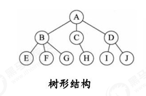

# 一、数据结构和算法概述

## 1.1 什么是数据结构？

数据结构是一门研究非数值计算的程序设计问题中的操作对象，以及他们之间的关系和操作等相关问题的学科。 

数据结构就是把数据元素按照一定的关系组织起来的集合，用来组织和存储数据

## 1.2 数据结构分类

传统上，我们可以把数据结构分为逻辑结构和物理结构两大类。

### **逻辑结构分类**

逻辑结构是从具体问题中抽象出来的模型，是抽象意义上的结构，按照对象中数据元素之间的相互关系分类，也是 我们后面课题中需要关注和讨论的问题。

**a. 集合结构**：集合结构中数据元素除了属于同一个集合外，他们之间没有任何其他的关系。

 

**b. 线性结构**：线性结构中的数据元素之间存在一对一的关系

 

**c. 树形结构**：树形结构中的数据元素之间存在一对多的层次关系

 

**d. 图形结构**：图形结构的数据元素是多对多的关系

 

### 物理结构分类

逻辑结构在计算机中真正的表示方式（又称为映像）称为物理结构，也可以叫做存储结构。常见的物理结构有顺序 存储结构、链式存储结构。

#### **顺序存储结构：**

 

把数据元素放到地址连续的存储单元里面，其数据间的逻辑关系和物理关系是一致的  ，比如我们常用的数组就是顺序存储结构。


顺序存储结构存在一定的弊端，就像生活中排时也会有人插队也可能有人有特殊情况突然离开，这时候整个结构都 处于变化中，此时就需要链式存储结构。

#### **链式存储结构：**

 

是把数据元素存放在任意的存储单元里面，这组存储单元可以是连续的也可以是不连续的。此时，数据元素之间并  不能反映元素间的逻辑关系，因此在链式存储结构中引进了一个指针存放数据元素的地址，这样通过地址就可以找 到相关联数据元素的位置


## 1.3 什么是算法？

#### 官方解释

算法是指解题方案的准确而完整的描述，是一系列解决问题的清晰指令，算法代表着用系统的方法解决问题的策略 机制。也就是说，能够对一定规范的输入，在有限时间内获得所要求的输出。

#### 大白话

根据一定的条件，对一些数据进行计算，得到需要的结果。


---

# 二、算法分析

## 2.1 算法的时间复杂度分析

事前分析估算方法：

1. 算法采用的策略和方案
2. 编译产生的代码质量
3. 问题的输入规模
4. 机器执行指令的速度

#### 2.1.1 时间复杂度分析策略

1. 只关注循环执行次数最多的一段代码

2. 加法法则：总复杂度等于量级最大的那段代码的复杂度

   > 如一个文件中三段代码的复杂度分别是O(1),O(n),O($n^2$)
   >
   > 那么最终算法复杂度就是O($n^2$)
   
3. 乘法法则：嵌套代码的复杂度等于嵌套内外代码复杂度的乘积

#### 2.1.2 常见的时间复杂度规模

| ***描述***   | ***增长的数量级*** | ***说明*** | ***举例***     |
| ------------ | ------------------ | ---------- | -------------- |
| 常数级别     | 1                  | 普通语句   | 将两个数相加   |
| 对数级别     | $\log_2n$          | 二分策略   | 二分查找       |
| 线性级别     | N                  | 循环       | 找出最大元素   |
| 线型对数级别 | $N\log2N$          | 分治思想   | 归并排序       |
| 平方级别     | $N^2$              | 双层循环   | 检查所有元素对 |
| 立方级别     | $N^3$              | 三层循环   | 检查所有三元组 |
| 指数级别     | $2^N$              | 穷举查找   | 检查所有子集   |


# 三、线性表

线性表是最基本、最简单、也是最常用的一种数据结构。一个线性表是n个具有相同特性的数据元素的有限序列。

前驱元素：

> 若A元素在B元素的前面，则称A为B的前驱元素

后继元素：

> 若B元素在A元素的后面，则称B为A的后继元素

**线性表的特征：**

> 数据元素之间具有一种“一对一”的逻辑关系。

1. 第一个数据元素没有前驱，这个数据元素被称为头结点；

2. 最后一个数据元素没有后继，这个数据元素被称为尾结点；

3. 除了第一个和最后一个数据元素外，其他数据元素有且仅有一个前驱和一个后继。

**线性表的分类：**

> 线性表中数据存储的方式可以是顺序存储，也可以是链式存储，按照数据的存储方式不同，可以把线性表分为顺序表和链表。

## **1.1** 顺序表

顺序表是在计算机内存中以数组的形式保存的线性表，线性表的顺序存储是指用一组地址连续的存储单元，依次存 储线性表中的各个元素、使得线性表中再逻辑结构上响铃的数据元素存储在相邻的物理存储单元中，即通过数据元素物理存储的相邻关系来反映数据元素之间逻辑上的相邻关系。


### **1.1.1**顺序表的实现

| 类名     | SequenceList <T>                                             |
| -------- | :----------------------------------------------------------- |
| 构造方法 | SequenceList(int capacity)：创建容量为capacity的SequenceList对象 |
| 成员方法 | 1. public void clear()：空置线性表<br>2. publicboolean isEmpty()：判断线性表是否为空，是返回true，否返回false <br/>3.public int length()：获取线性表中元素的个数<br/>4. public T get(int i)：读取并返回线性表中的第i个元素的值<br/>5. public void insert(int i,T t)：在线性表的第i个元素之前插入一个值为t的数据元素。<br/>6.public void insert(T t)：向线性表中添加一个元素t（默认在最后一处添加）<br/>7. public T remove(int i)：删除并返回线性表中第i个数据元素。<br/>8. public int indexOf(T t)：返回线性表中首次出现的指定的数据元素的位序号，若不存在，则返回-1。 |
| 成员变量 | 1.private T[] eles：存储元素的数组<br/>2.private int N：当前线性表的长度 |


 

***顺序表的代码实现：***

```java
package Linear;

public class SequenceList<T> {
    //储存元素的数组
    private T[] eles;
    //保存当前线性表的元素个数
    private int N;

    //构造方法
    public SequenceList(int capacity) {
        //初始化数组，因为线性表是借助数组为基础创建的
        //this.eles = new T[capacity]; (这样写不符合java语法规则）
        this.eles = (T[]) new Object[capacity];
        //初始化长度
        this.N = 0;
    }

    ;

    //将线性表置为空表
    public void clear() {
        this.N = 0;
    }

    //判断当前线性表是否为空
    public boolean isEmpty() {
        return N == 0;
    }

    //获取线性表长度
    public int length() {
        return N;
    }

    //获取指定位置的元素
    public T get(int i) {
        return eles[i];
    }

    //向线性表中添加元素T（于末尾处）
    public void insert(T t) {
        eles[N++] = t;
    }

    //在位置i处添加元素t（重载一次insert）
    public void insert(T t, int i) {
        //将i和后面元素后移
        for (int index = N - 1; index > i; index--) {
            eles[index] = eles[index - 1];
        }
        //将空位放上数字
        eles[i] = t;
    }

    //删除指定位置处的元素并返回该元素
    public T remove(int i) {
        //记录索引i位置的值
        T res = eles[i];
        //将后置位的所有元素向前
        for (int index = i; index < N - 1;index++ ){
            eles[index] = eles[index+1];
        }
        //元素个数-1
        N--;
        return res;
    }

    //查找t元素第一次出现的位置
    public int indexOf(T t){
        //遍历查找
        for(int i = 0;i<N ;i++){
            if(eles[i].equals(t)){
                return i;
            }
        }
        //通过返回-1来表示没有找到需要的索引
        return -1;
    }
}

```

 

### **1.1.2** 顺序表的遍历

作为容器需要给外部提供一个遍历容器的接口。

Java中一般使用foreach循环来解决，所以在自己的容器中实现需要做以下操作：

1. 让SequenceList实现Iterable的接口，重写iterable方法；
2. 在SequenceList内部提供一个内部类SIterator，实现Iterator接口，重写hasNext方法和next方法


***顺序表遍历的代码实现：***

```java
@Override
    public Iterator<T> iterator() {
        return new SIterator();
    }

    //由于重写的Iterator是继承于接口不能实例化，所以这里写一个内部类来完成
    private class SIterator implements Iterator{
        private int cusor;
        public SIterator(){
            this.cusor = 0;
        }
        @Override
        //判断容器中还有没有下一个元素
        public boolean hasNext() {
            return cusor<N;
        }
        //返回下一个元素并将指针后移
        @Override
        public Object next() {
            return eles[cusor++];
        }
    }

```


### **1.1.3** 顺序表的扩容

#### 什么时候扩容

##### 添加元素时扩容

当当前大小与数组长度相同时扩为原来两倍

##### 移除元素时缩容

当当前数组使用小于长度1/4时缩为原来1/2


#### 实现思路

1. 建立resize方法：接收新的数组长度并将原数组改为新长度
2. 在insert与remove方法中建立判断并调用resize方法


***顺序表扩容的代码实现：***

```java
    //根据参数newsize，重置eles的大小
    //这样做的好处时无论扩容还是缩容都可以调用这个方法
    //这里直接将原数组的引用指向改变了，所以不用返回值
    public void resize(int newSize){
        //定义一个临时数组，指向原数组
        T[] temp = eles;
        //不要忘记生成新数组时进行强制转换
        eles = (T[])new Objects[newSize];
        //将原数组的数据拷贝至新数组
        for(int i= 0 ;i<N;i++){
            eles[i] = temp[i];
        }
    }

    public void insert(T t) {
        //判断并扩容
        if(N==eles.length){
            resize(eles.length*2+1);
        }
        eles[N++] = t;
    }

```


### **1.1.3** 顺序表的时间复杂度

```java
get(int i):无论N为多少，只需要一次eles[i]就能获取需要的数据，所以时间复杂度为1；

insert(int i,T t):每一次插入都需要移动后面的元素，N越大移动越多，所以时间复杂度为O(n);

remove(int i,T t):每一次删除都需要移动后面的元素，N越大移动越多，所以时间复杂度为O(n);

```

由于存在扩容等操作，需要重新申请一块内存，所以在某一点时时间复杂度会突然变高，不线性。


### **1.1.4**Java中的ArrayList的实现

Q1.是否用数组操作

```java
transient Object[] elementData; // non-private to simplify nested class access

public boolean add(E e) {
    ensureCapacityInternal(size + 1);  // Increments modCount!!
    elementData[size++] = e;
    return true;
}
```

Q2.有没有扩容操作

```java
    private void ensureCapacityInternal(int minCapacity) {
        ensureExplicitCapacity(calculateCapacity(elementData, minCapacity));
    }

    private void ensureExplicitCapacity(int minCapacity) {
        modCount++;

        // overflow-conscious code
        if (minCapacity - elementData.length > 0)
            grow(minCapacity);
    }

    private void grow(int minCapacity) {
        // overflow-conscious code
        int oldCapacity = elementData.length;
        int newCapacity = oldCapacity + (oldCapacity >> 1);
        if (newCapacity - minCapacity < 0)
            newCapacity = minCapacity;
        if (newCapacity - MAX_ARRAY_SIZE > 0)
            newCapacity = hugeCapacity(minCapacity);
        // minCapacity is usually close to size, so this is a win:
        elementData = Arrays.copyOf(elementData, newCapacity);
    }

```


Q3.有没有提供遍历方式

```java
    private class Itr implements Iterator<E> {
        int cursor;       // index of next element to return
        int lastRet = -1; // index of last element returned; -1 if no such
        int expectedModCount = modCount;

        Itr() {}

        public boolean hasNext() {
            return cursor != size;
        }

        @SuppressWarnings("unchecked")
        public E next() {
            checkForComodification();
            int i = cursor;
            if (i >= size)
                throw new NoSuchElementException();
            Object[] elementData = ArrayList.this.elementData;
            if (i >= elementData.length)
                throw new ConcurrentModificationException();
            cursor = i + 1;
            return (E) elementData[lastRet = i];
        }
```

### **1.1.4**什么时候不用ArrayList

1. 考虑到安全性等因素ArrayList整体比较臃肿，可能执行效率较低
2. 业务开发中有额外需求的时候自己写出来的容器更加灵活


## 1.2 链表

节点API设计：

| 类名     | Node<T>                                       |
| -------- | --------------------------------------------- |
| 构造方法 | Node(T t , Node next):创造Node对象            |
| 成员变量 | T item：存储数据<br>Node next：指向下一个节点 |

***顺序表扩容的代码实现：***

```java
public class Node<T>{
	//存储元素
	public T item;
	//指向下一个节点
	public Node(T item,Node next){
		this.item = item;
		this.next = next;
	}
}
```


```java
public static void main(String[] args)throw Exception {
	//构建节点
	Node<Integer> first = new Node<Integer>(11,null);
	Node<Integer> second = new Node<Integer>(12,null);
	Node<Integer> third = new Node<Integer>(13,null);
	Node<Integer> fourth = new Node<Integer>(14,null);
	Node<Integer> fifth = new Node<Integer>(15,null);
	
	//生成链表
	first.next = second;
	second.next = third;
	third.next = fourth;
	fourth.next = fifth;
}
```


### 1.2.1 单向链表

> 每一个节点都是由一个数据域和一个指针域组成
>
> 数据域用以存储数据，指针域用来指向其他后续节点

> 链表的***头节点的数据域不存储数据***，指针域指向第一个真正存储数据的节点

#### 1.2.1.1 单向链表的API设计

| 类名       | LinkList<T>                                                  |
| ---------- | ------------------------------------------------------------ |
| 构造方法   | LinkList：创建LinkList对象                                   |
| 成员方法   | 1.public void clear(): 空置线性表<br>2.public boolean isEmpty(): 判断线性表是否为空，是返回true，否返回false<br>3.public int length(): 获取线性表中元素的个数<br>4.public T get(int i): 读取并返回线性表中的第i个元素的值<br>5.public void insert(T t): 往线性表中插入一个元素<br>6.public void insert(T t,int i): 在第i个位置插入一个元素<br>7.public T remove(int t): 删除并返回线性表中第i个数据元素<br>8.public  int indexOf(T t): 返回线性表中首次出现指定的数据元素序列号，不存在返回-1 |
| 成员内部类 | private class Node<T>：节点类                                |
| 成员变量   | 1.private Node head: 记录头节点<br>2.private int N: 记录链表的长度 |

#### 1.2.1.2 单向链表代码实现

```java
package Linear;

import java.util.Iterator;

public class LinkList<T> implements Iterable<T>{
    //记录头节点
    //头节点不存数据！！！
    private Node head;
    //记录链表长度
    private int N;

    @Override
    public String toString() {
        return "LinkList{" +
                "head=" + head +
                ", N=" + N +
                '}';
    }

    //节点类
    public class Node {
        //存储数据的T
        public T item;
        //指向下一个节点
        public Node next;

        public Node(T item, Node next) {
            this.item = item;
            this.next = next;
        }
    }

    public LinkList() {
        //初始化头节点
        //初始化头节点时其不指向任何一个节点，所以置为0
        this.head = new Node(null, null);
        //初始化元素个数
        this.N = 0;
    }

    public void clear() {
        //头节点清空指向
        head.next = null;
        //N置0
        this.N = 0;
    }

    public int length() {
        return N;
    }

    public boolean isEmpty() {
        return N == 0;
    }

    public T get(int i) {
        //通过循环从头节点开始往后找i次
        Node n = head.next;
        for (int index = 0; index < i; index++) {
            //每一次将节点后移，从而得到i处节点
            n = n.next;
        }
        //返回i处节点元素的数据
        return n.item;
    }

    public void insert(T t) {
        //让最后一个节点指向一个新节点就够了
        //1.找到当前最后一个节点
        Node n = head;
        while (n.next != null) {
            n = n.next;
        }
        //2.创建新节点，保存元素T，并创建前最后一个节点和新节点的连接
        n.next = new Node(t, null);
        //3.元素个数+1
        N++;
    }

    public void insert(int i,T t) {
        //找到i位置前一个节点
        Node pre = head;
        for (int index = 0; index < i - 1; index++) {
            pre = pre.next;
        }
        //找到i位置节点，用curr指向它
        Node curr = pre.next;
        //创造新节点并指向原来i位置
        Node newNode = new Node(t, curr);
        //i位置前一个节点指向新节点
        pre.next = newNode;
        //元素个数+1
        N++;
    }

    public T remove(int i) {
        //找到前一个节点，令其跳过i节点，直接指向下一个节点
        Node pre = head;
        for (int index = 0; index < i - 1; i++) {
            pre = pre.next;
        }
        //找到i节点，用curr指向它
        Node curr = pre.next;
        //找到i节点的下一个节点
        Node nextNode = curr.next;
        //前节点指向下一个节点
        pre.next = nextNode;
        //元素个数-1
        N--;
        return curr.item;
    }


    public int indexOf(T t){
        //从头节点开始进行数据的比对
        Node n = head;
        //用n.next!=null来作为条件
        for(int i=0;n.next!=null;i++){
            n = n.next;
            if(n.item.equals(t)){
                return i;
            }
        }
        return -1;
    }

    @Override
    public Iterator iterator() {
        return new LIterator();
    }

    //为 iterator方法准备一个内部类
    private class LIterator implements Iterator{
        //为单向链表所实现的Iterator
        private Node n;
        //为node提供一个方法,让其指向头节点
        public LIterator(){
            this.n=head;
        }
        @Override
        public boolean hasNext() {
            return n.next!=null;
        }

        @Override
        public Object next() {
            //让头节点指向下一个，也就是第一个带数据的节点并返回数据
            n = n.next;
            return n.item;
        }
    }

}
```


### 1.2.2 双向链表

> 每一个节点都是由一个数据域和两个指针域组成
>
> 数据域用以存储数据，一个指针域用来指向当前节点的上一个节点，一个指针域指向当前节点的下一个节点

> 链表的***头节点的数据域不存储数据***，指针域指向第一个真正存储数据的节点

#### 1.2.2.1 双向链表的API设计

| 类名       | DoublyLinkedList<T>                                          |
| ---------- | ------------------------------------------------------------ |
| 构造方法   | DoublyLinkedList：创建DoublyLinkedList对象                   |
| 成员方法   | 1.public void clear(): 空置线性表<br>2.public boolean isEmpty(): 判断线性表是否为空，是返回true，否返回false<br>3.public int length(): 获取线性表中元素的个数<br>4.public T get(int i): 读取并返回线性表中的第i个元素的值<br>5.public void insert(T t): 往线性表中插入一个元素<br>6.public void insert(T t,int i): 在第i个位置插入一个元素<br>7.public T remove(int t): 删除并返回线性表中第i个数据元素<br>8.public  int indexOf(T t): 返回线性表中首次出现指定的数据元素序列号，不存在返回-1<br>9.public T getFirst(): 获取第一个元素<br>10.public T getLast():获取最后一个元素 |
| 成员内部类 | private class Node<T>：节点类                                |
| 成员变量   | 1.private Node first: 记录头节点<br>2.private Node last: 记录末节点<br>3.private int n:记录链表长度 |

#### 1.2.2.2 单向链表代码实现

```java
package Linear;

import java.util.Iterator;

public class DoublyLinkedList<T> implements Iterable<T>{
    private Node head;
    private Node last;
    private int N;


    private class Node {
        public Node pre;
        public Node next;
        public T item;

        public Node(Node pre, Node next, T item) {
            this.pre = pre;
            this.next = next;
            this.item = item;
        }
    }

    public DoublyLinkedList() {
        //初始化头尾节点
        this.head = new Node(null, null, null);
        this.last = new Node(null, null, null);
        this.N = 0;
    }

    public void clear() {
        this.head.next = null;
        this.last = null;
        this.N = 0;
    }

    public int length() {
        return N;
    }

    public boolean isEmpty() {
        return N == 0;
    }

    public T getFirst() {
        if (N == 0) {
            return null;
        }
        else {
            //时刻牢记head并不是第一个存储数据的节点
            return head.next.item;
        }
    }

    public T getLast(){
        if(isEmpty()){
            return  null;
        }else {
            return last.item;
        }
    }

    public void add(T t){
        //由于双向链表有指向前一个节点的指针，所以需要判断当前链表是否为空
        //否则pre指针会发生空指针引用
        if(isEmpty()){
            Node newNode = new Node(head,null,t);
            //将其置为尾节点
            last = newNode;
            //将头节点指针指向
            head.next = newNode;
        }
        else{
            Node newNode = new Node(last,null,t);
            //让前一个节点的next指向新节点
            newNode.pre.next =newNode;
            //将新节点置为末尾节点
            last =newNode;
        }
        //长度+1
        N++;
    }

    public void add(int i,T t){
        //找到i位置的前一个节点
        Node pre = head;
        for(int index=0;index<i-1;index++){
            pre= pre.next;
        }
        //找到i位置节点(add过后它就为新节点的下一个节点了)
        Node curr= pre.next;
        //创建新节点
        Node newNode = new Node(pre,curr,t);
        //建立前后节点连接
        pre.next = newNode;
        curr.pre = newNode;
        //长度+1
        N++;
    }

    public T get(int i){
        Node n = head;
        for(int index=0;index<i ;index++){
            n = n.next;
        }
        return n.item;
    }

    public int indexOf(T t){
        Node n = head;
        int i = 0;
        while(n.next!=null){
            i++;
            n = n.next;
            if(n.item.equals(t)){
                return i;
            }
        }
        return -1;
    }

    public T remove(int i){
        //找到前后节点并将他们建立联系
        Node n = head;
        for(int index = 0;index<i;index++){
            n = n.next;
        }
        n.pre.next = n.next;
        //防止是最后一个节点而发生空指针引用
        if(!n.equals(last)){
            n.next.pre = n.pre;
        }
        //长度-1
        N--;
        //返回i处原数据
        return n.item;
    }

    //提供一个私有迭代器类使得方法内的iterator能够调用从头开始遍历
    private class DLLIterator1 implements Iterator{
        private Node n;
        //构造方法里让n等于头节点
        public DLLIterator1(){
            this.n = head;
        }
        @Override
        public boolean hasNext() {
            return n.next!=null;
        }

        //移动的是节点n，但是返回的是对应的item
        @Override
        public Object next() {
            n =n.next;
            return n.item;
        }
    }


    @Override
    public Iterator iterator() {
        return new DLLIterator1();
    }

}
```

### 1.2.3 链表的复杂度分析

get(int i),insert(int i),remove(int i): O(n) 

### 1.2.4 链表反转

#### 1.2.4.1 单链表反转

反转API：

```
public void reverse()：对整个链表进行反转
public Node reverse(Node curr)：对当前链表进行反转
```

代码实现

```java
    //反转整个链表
    public void reverse(){
        //判断是否为空链表
        if(isEmpty()){
            return;
        }
        else{
            reverse(head.next);
        }
    }

    //对单个节点实现反转并递归实现
    public Node reverse(Node curr){
        //需设置递归结束条件，出口是递归到了最后一个节点
        //此时将头节点指向那个节点，并将其返回
        if(curr.next == null){
            head.next = curr;
            return curr;
        }
        //去反转当前节点的下一个节点以达到递归效果
        //当前节点的下一个节点反转后就是当前节点的前一个节点
        //所以给返回值定名为pre
        Node pre = reverse(curr.next);
        //让返回的节点成为当前的节点
        pre.next = curr;
        //把当前节点的下一个节点变为null
        curr.next = null;
        return curr;
    }
```


### 1.2.5 快慢指针

创建一个测试节点的Test类

```java
public statcic void main(String[] args){
	Node<String> first = new Node<String>("AA",null);
	Node<String> second = new Node<String>("Ab",null);
	Node<String> third = new Node<String>("Ac",null);
	Node<String> fourth = new Node<String>("Ad",null);
	Node<String> fifth = new Node<String>("Ae",null);
	Node<String> sixth = new Node<String>("Af",null);
	
	first.next = second;
	second.next = third;
	third.next = fourth;
	fourth.next = fifth;
	fifth.next = sixth;
	sixth.next = third;
	
	private static class Node<T>{
		T item;
		Node next;
		
		public Node(T itme,Node next){
			this.itme = itme;
			this.next = next;
		}
	}
}
```


#### 1.2.5.1 中间值问题

```java
public static String getMid(Node<String> first){
	//定义两个指针
	Node<T> fast = first;
	Node<T> slow = first;
	//使用两个指针遍历链表，快指针指向结尾时慢指针就是中间值
	while(fast!=null && fast.next!=null){
		//指针移动
		fast = fast.next.next;
		slow = slow.next;
	}
	retrun slow.item;
}
```

#### 1.2.5.2 单向链表中有环问题

**1.  判断是否有环**

```java
//同样使用快慢指针，只要存在环，那么快指针一定会追上慢指针
public boolean isCircle(Node<String> first){
		//定义两个指针
	Node<T> fast = first;
	Node<T> slow = first;
	//使用两个指针遍历链表，快指针指向结尾时慢指针就是中间值
	while(fast!=null && fast.next!=null){
		//指针移动
		fast = fast.next.next;
		slow = slow.next;
		//如果相遇说明有环
		if(fast.equals(slow)){
			retrun true;
		}
	}
	//遍历完还是没有相等，那就说明没环
	retrun false;
}
```

**2.  找到环的入口**

实现原理：

> 当快慢指针相遇时，重新设定一个新指针指向链表起点，且步长与慢指针一致；
>
> 则慢指针与新指针相遇的地方就是环的入口
>
> - ![[公式]](https://www.zhihu.com/equation?tex=L_1) 为链表头 head 到环入口的距离
> - ![[公式]](https://www.zhihu.com/equation?tex=L_2) 为从环入口向前到相遇点的距离 **(按照指针前进的方向计算)**
> - ![[公式]](https://www.zhihu.com/equation?tex=L_3) 为从相遇点向前到环入口的距离 **(按照指针前进的方向计算)**
> - ![[公式]](https://www.zhihu.com/equation?tex=C) 为环的周长
> - ![[公式]](https://www.zhihu.com/equation?tex=N_1) 和 ![[公式]](https://www.zhihu.com/equation?tex=N_2) 分别为 slow 和 fast 在相遇时走过的圈数（向下取整）
> - ![[公式]](https://www.zhihu.com/equation?tex=disSlow+) 和 ![[公式]](https://www.zhihu.com/equation?tex=disFast) 分别为 slow 和 fast 在相遇时走过的距离
>
> 示意图如下：
>
>  
>
> 则：
>
> ![[公式]](https://www.zhihu.com/equation?tex=disSlow+%3D+L_1+%2B+L_2+%2B+N_1C) 
>
> ![[公式]](https://www.zhihu.com/equation?tex=disFast+%3D+L_1+%2B+L_2+%2B+N_2C+) 
>
> 又因为 fast 速度是 slow 的 2 倍，所以：
>
> ![[公式]](https://www.zhihu.com/equation?tex=disSlow+%2A+2+%3D+disFast+) 
>
> ![[公式]](https://www.zhihu.com/equation?tex=%5CRightarrow+2%28L_1+%2B+L_2+%2B+N_1C%29+%3D+L_1+%2B+L_2+%2B+N_2C+) 
>
> ![[公式]](https://www.zhihu.com/equation?tex=%5CRightarrow+L_1+%2B+L_2+%2B+2N_1C+%3D+N_2C+) 
>
>  
>
> 因为 fast 的速度是 slow 的两倍，所以 ![[公式]](https://www.zhihu.com/equation?tex=N_2)至少是 ![[公式]](https://www.zhihu.com/equation?tex=N_1) 的两倍（至少而不是恰好是因为 fast 进入环时 slow 可能还没进入环，所以 fast 可能会先在环内走几圈），
>
> 即
>
> ![[公式]](https://www.zhihu.com/equation?tex=N_2+%3E%3D+2N_1+) 
>
> 这里其实还可以求出的是，当 ![[公式]](https://www.zhihu.com/equation?tex=N_2) 等于 2 倍的 ![[公式]](https://www.zhihu.com/equation?tex=N_1) 的时候， ![[公式]](https://www.zhihu.com/equation?tex=L_1) 和 ![[公式]](https://www.zhihu.com/equation?tex=L_2) 都为 0 ，也就是整个链表就是一个环 。
>
> 由此可以看出， ![[公式]](https://www.zhihu.com/equation?tex=L_1) 即链表头 head 到环入口的距离就等于 ![[公式]](https://www.zhihu.com/equation?tex=%28N_2+-+2N_1%29C+-+L_2) ，其实就等于 ![[公式]](https://www.zhihu.com/equation?tex=L_3+%2B+%28N_2+-+2N_1+-+1%29C) **（注意** ![[公式]](https://www.zhihu.com/equation?tex=L_3) **是按照指针前进方向算的，并不是最小距离，所以这个结果对于整个链表都是环也是有效的）** ，而从相遇点向前走 ![[公式]](https://www.zhihu.com/equation?tex=L_3+%2B+%28N_2+-+2N_1+-+1%29C) 的距离，正好就走到了环的入口**（如果没理解可以在图上比划一下即可）**，所以我们就可以推导出算法，即：让两个指针其中一个从链表头 head 出发，一次走一步，让另一个指针从相遇点出发，也一次走一步，相遇点就是环的入口。

```java
public static Node getEntrance(Node<String> first){
	//定义两个指针
	Node<T> fast = first;
	Node<T> slow = first;
	Node<T> temp = null;
	//使用两个指针遍历链表，快指针指向结尾时慢指针就是中间值
	while(fast!=null && fast.next!=null){
		//指针移动
		fast = fast.next.next;
		slow = slow.next;
		//如果相遇说明有环相遇了
		if(fast.equals(slow)){
             //让temp指向首个节点
			temp = first;
             continue;
		}
         //让临时节点进行移动
         if(temp!=null){
             temp = temp.next;
             //判断相遇
             if(temp.equals(slow)){
                 break;
             }
         }
        
	}
	//遍历完还是没有相等，那就说明没环
	retrun temp;
}
```

### 1.2.6 循环链表

#### 1.2.6.1 循环链表的构建

```java
public statcic void main(String[] args){
	Node<String> first = new Node<String>("AA",null);
	Node<String> second = new Node<String>("Ab",null);
	Node<String> third = new Node<String>("Ac",null);
	Node<String> fourth = new Node<String>("Ad",null);
	Node<String> fifth = new Node<String>("Ae",null);
	Node<String> sixth = new Node<String>("Af",null);
	
	first.next = second;
	second.next = third;
	third.next = fourth;
	fourth.next = fifth;
	fifth.next = sixth;
	sixth.next = first;
	
	private static class Node<T>{
		T item;
		Node next;
		
		public Node(T itme,Node next){
			this.itme = itme;
			this.next = next;
		}
	}
}
```

#### 1.2.6.2 约瑟夫问题

```java
public class JosephTest {
    public static void main(String[] args) {
        //建立循环链表
        //记录首节点
        Node<Integer> first = null;
        //用来记录前一个节点
        Node<Integer> pre = null;
        for(int i = 1; i<=41;i++){
            //第一个节点的插入方式
            if(i == 1){
                first = new Node<>(i,null);
                pre = first;
                continue;
            }
            //中间节点的插入方式
            Node<Integer> newNode =  new Node<>(i,null);
            pre.next = newNode;
            pre = newNode;
            //最后一个节点指向第一个节点
            if(i == 41){
                pre.next = first;
            }
        }

        //构建计数器
        int count = 0;
        
        //建立退出机制
        Node<Integer> n = first;
        //记录当前节点的上一个节点以改变指针指向
        Node<Integer> pre1 = null;
        while(n!=n.next){
            //开始报数
            count++;
            //判断是否为3
            //true：当前节点删除调用，并打印
            if(count%3==0){
                pre1.next = n.next;
                System.out.print(n.item+",");
            }
            //false：让pre1和当前节点各向后移动一位
            else{
                pre1 = n;
            }
            //n向后移动
            n = n.next;
        }
        //打印最后一个元素
        System.out.println(n.item);
        
    }
    private static class Node<T>{
        T item;
        Node next;

        public Node(T item,Node next){
            this.item = item;
            this.next = next;
        }
    }
}
```


## 1.3 栈

栈是一种先进后出的数据结构(FILO)，只能在一段进行插入和删除操作的特殊线性表

数据进入称作**压栈**，数据出栈成为**弹栈**

### 1.3.1 栈的实现

#### 1.3.1.1 栈API设计

| 类名       | Stack<T>                                                     |
| ---------- | ------------------------------------------------------------ |
| 构造方法   | stack()：创建LinkList对象                                    |
| 成员方法   | 1.public boolean isEmpty(): 判断栈是否为空，是返回true，否返回false<br>2.public int size(): 获取栈中元素的个数<br>3.public T pop(): 弹出栈顶元素<br>4.public void push(T t): 向栈中压入元素 |
| 成员内部类 | private class Node<T>：节点类                                |
| 成员变量   | 1.private Node head: 记录头节点<br>2.private int N: 记录栈元素个数<br>3.private Node head: 记录头节点 |

#### 1.3.1.2 栈的代码实现

```java
package Linear;

import java.util.Iterator;

public class Stack<T> implements Iterable<T> {
    private Node head;
    private int N;


    private class Node{
        private T item;
        private Node next;

        public Node(T item, Node next) {
            this.item = item;
            this.next = next;
        }
    }

    public Stack(){
        head=new Node(null,null);
        N = 0;
    }

    public boolean isEmpty(){
        return N==0;
    }

    public int size(){
        return N;
    }

    public void push(T t){
        //找到首节点指向的[原首节点]
        Node oldFirst = head.next;
        //创建新节点并且与首节点建立联系
        Node newNode = new Node(t,null);
        head.next = newNode;
        //让新节点指向[原首节点]
        newNode.next = oldFirst;
        //长度+1
        N++;
    }

    public T pop(){
        //找到首节点指向的[原首节点]
        Node oldFirst = head.next;
        //改变首节点指向
        if(oldFirst!=null){
            head.next = oldFirst.next;
        }
        else{
            return  null;
        }
        //长度-1
        N--;
        return oldFirst.item;
    }

    @Override
    public Iterator iterator() {
        return new SIterator();
    }

    private class SIterator implements Iterator{
        //要提供一个成员变量记录当前的节点
        private Node n;
        @Override
        public boolean hasNext() {
            return n.next!=null;
        }

        @Override
        public Object next() {
            n = n.next;
            return n.item;
        }
        //在提供的构造方法中令n=head
        public SIterator() {
            this.n = head;
        }
    }
}
```

### 1.3.2 栈的的应用

#### 1.3.2.1 括号匹配问题

```java
package Test;

import Linear.Stack;

public class BracketMatchTest {
    public static void main(String[] args) {
        String str = "sfaf((())))";
        System.out.println(isMatch(str));
    }

    public static boolean isMatch(String string){
        //创建对象，用来储存左括号
        Stack<Character> chars = new Stack<>();
        //从左往右遍历字符串
        for(int i = 0;i<string.length();i++){
            Character c = string.charAt(i);
            //判断当前字符是否为左括号，是则放入栈
            if(c.equals('(')){
                chars.push(c);
            }
            if(c.equals(')')){
                if(chars.pop()==null){
                    return false;
                }
            }
        }
        return (chars.pop()==null);
        //继续判断是否是右括号，是则从栈弹出一个左括号，结果为null则没有匹配的左括号
        //判断栈中还有没有剩余左括号，有则证明也不匹配
    }
}
```

#### 1.3.2.2 逆波兰表达式的问题

```java
package Test;

import Linear.Stack;

public class ReversePolishNotationTest {
    public static void main(String[] args) {
        //中缀表达式 3*(17-15) + 18/6 的逆波兰表达式如下
        String[] notation ={"3","17","15","-","*","18","6","/","+"};
        System.out.println(calculate(notation));
    }

    public static int calculate(String[] strings){
        //定义一个栈用来存储操作数
        Stack<Integer> operator = new Stack<>();
        //从左到右遍历逆波兰表达式，得到每一个元素
        for(int i =0;i<strings.length;i++){
              String curr = strings[i];
              Integer o1;
              Integer o2;
              switch (curr){
                  case "+":
                      o1 = operator.pop();
                      o2 = operator.pop();
                      operator.push(o2+o1);
                      break;
                  case "-":
                      o1 = operator.pop();
                      o2 = operator.pop();
                      operator.push(o2-o1);
                      break;
                  case "*":
                      o1 = operator.pop();
                      o2 = operator.pop();
                      operator.push(o1*o2);
                      break;
                  case "/":
                      o1 = operator.pop();
                      o2 = operator.pop();
                      operator.push(o2/o1);
                      break;
                  default:
                      operator.push(Integer.valueOf(curr));
              }
        }
        //判断当前元素是运算符还是操作数
        //运算符则从栈弹出两个操作数，完成运算后再把结果压入栈中
        //得到栈中最后一个元素，就是最终的结果
        return operator.pop();
    }
}
```


## 1.4 队列

栈是一种先进先出的数据结构(FIFO)，只能在一段进行插入，在另一端进行删除操作的特殊线性表

### 1.4.1 队列的实现

#### 1.4.1.1 队列API设计

| 类名       | Queue<T>                                                     |
| ---------- | ------------------------------------------------------------ |
| 构造方法   | stack()：创建LinkList对象                                    |
| 成员方法   | 1.public boolean isEmpty(): 判断队列是否为空，是返回true，否返回false<br>2.public int size(): 获取队列中元素的个数<br>3.public T dequeue(): 弹出栈顶元素<br>4.public void enqueue(T t): 向队列中插入元素 |
| 成员内部类 | private class Node<T>：节点类                                |
| 成员变量   | 1.private Node head: 记录头节点<br>2.private int N: 记录栈元素个数<br>3.private Node head: 记录头节点 |

