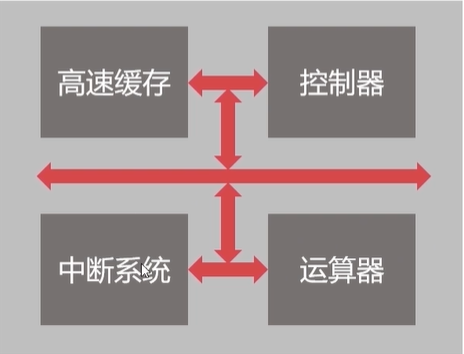
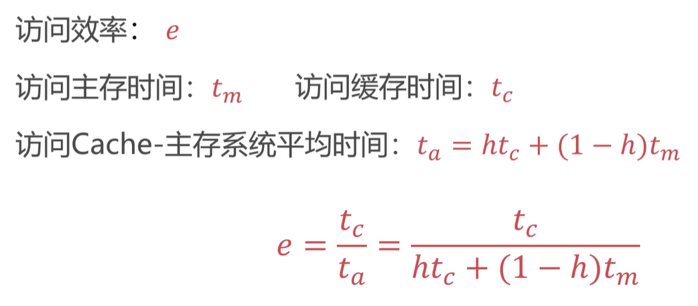
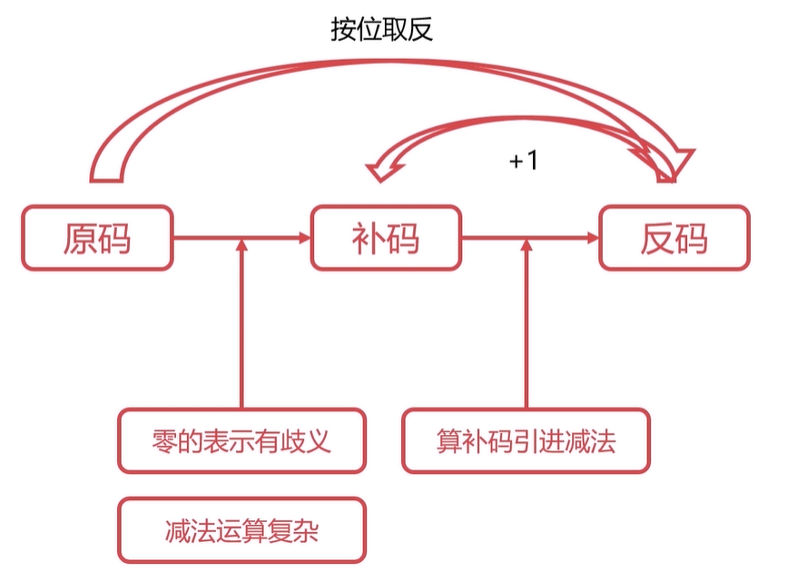
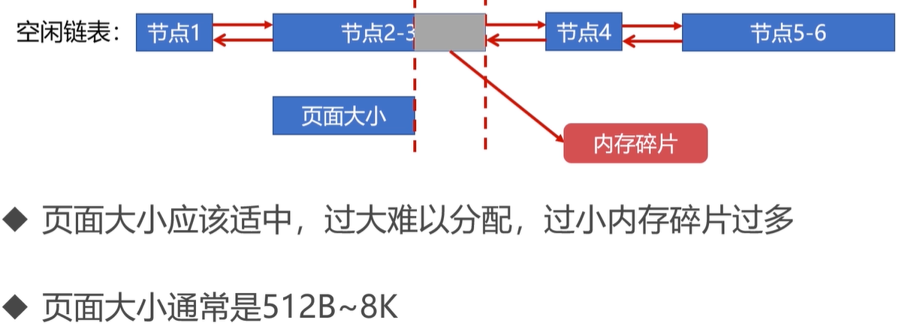

# 计算机基础知识

## 计算机组成原理

### 概览篇

#### 计算机的发展史

##### 发展的四个阶段

1.电子管计算机

> 二战催生的英军破译德军密码需求

2.晶体管计算机

> 4k 每秒200000指令

3.集成电路计算机

> 德州仪器的工程师发明了集成电路（IC)
>
> 不同的设备要不同的人去维护
>
> IBM 推出了 System/360 就是操作系统的雏形

4.超大规模集成计算机

> 一个芯片集成了百万晶体管 

##### 微型计算机发展史

CPU算力

CPU集成核数

#### 计算机的分类

##### 五大分类

1.超级计算机

2.大型计算机

3.迷你计算机（服务器）

>云服务就是基于普通服务器集群之上的
>
>普通服务器已经替代了传统大型机器，成为大规模企业计算的中枢了

4.工作站

5.微型计算机

#### 计算机的体系与结构

##### 冯诺依曼体系

早期计算机要改变用途需要重新设计电路

> 冯诺依曼的思想就是
>
> 存储程序指令
>
> 设计通用电路

输入设备

输出设备

存储器

控制器

运算器

##### 冯诺依曼瓶颈

由于CPU处理速度快而存储设备处理速度慢，常常导致CPU空转等待数据传输

##### 现代计算机的结构

以存储器为核心的冯诺依曼结构计算机

#### 计算机的层次和编程语言

L1语言到L0语言的生成过程为程序翻译（由编译器完成）

>翻译过程生成了新的L0程序

L1语言作为输入，由L0语言来执行另一个程序（由解释器完成）

> 解释过程不生成新的L0程序
>
> 解释过程由L0编写的解释器去解释L1程序

程序翻译

> C/C++
>
> Object-c
>
> Golang

程序解释

>Python
>
>PHP
>
>Javascript

翻译+解释

>Java
>
>c#

##### 以Java为例

Java——>JVM字节码——>机器码

#### 计算单位

##### 容量单位

###### 名称

1Byte = 8bits

1kb = 1024b

1024 = 2^10

###### 进制&运算

为什么买的移动硬盘500G，使用只有400多G？

> 因为硬盘商出于扇区等方便考虑，采取了10进位来标记容量，用1000代替了1024

##### 速度单位

###### 网络速度

为什么电信运营商的速度100m到手了12m/s

> 因为这里的100M并不是容量单位
>
> 100m=100M/s=100Mpbs=100Mbit/s
>
> 100Mbit/s=12.5MB/s

###### 计算速度

时钟频率，单应为Hz（秒分之一）

#### 计算机的字符与编码集

##### 发展历史

###### 早期英美的ASCII码

> 只用7个bit就能包含所有的内容
>
> 95个可打印字符
>
> 33个不可打印字符
>
> 95+33=2^7

###### Externed ASCII码

> 扩充后的7bit变为了8bit
>
> 128位扩展到了256位
>
> 多了数学运算符，带音标的欧洲字符，表格符等

###### 国际化

##### 中文编码集

###### GB2312

> 一套不符合国际标准的编码集

###### GBK

###### Unicode

> 兼容了全球通用的编码集

###### UTF-8

> 8就是8字节的Unicode编码

### 组成篇

#### 计算机的总线

##### 总线的概述

###### 总线是什么

> USB = “Universal Serial Bus" 通用串行总线
>
> 提供了计算机对外的接口
>
> 解决不同设备间的通信问题

###### 片内总线

 

> 芯片内部的总线，连接寄存器与寄存器
>
> 连接寄存器与控制器、运算器

######  系统总线

  

数据总线

> 与CPU位数相同（32位、64位），决定了一次能够传输多少位数的数据

地址总线

> 传递地址，用来寻址
>
> 指定元数据或目的数据在内存中的位置
>
> 地址总线位数 n,则寻址范围为0~2^n

控制总线

> 用来发出各种控制信号的传输线
>
> 控制限号经过控制总线从一个组件发给另一个组件
>
> 控制总线可以监视不同组件之间的状态（是否就绪）

##### 总线的仲裁

###### 为什么要仲裁

> 假设主存需要和硬盘、IO设备交换数据，这两者同时处于就绪状态时谁使用总线呢？
>
> 为了解决总线使用权的冲突，就有了三个解决方法

###### 链式查询（方法一）

同时发送请求时会从1-2-3的顺序来授权总线的使用

  

> 好处：电路复杂度低，仲裁方式简单
>
> 坏处：优先级低的设备难以获得控制权，对电路故障敏感（串联结构导致）

###### 计时器定时查询（方法二）

1. 仲裁控制器对设备编号并且使用计数器累计计数

2. 接收到仲裁信号后，往所有设备发出计数值

3. 计数值与设备编号一致则获得总线使用权

   

 

###### 独立请求（方法三）

 

> 好处：响应速度快，优先顺序可以动态改变
>
> 坏处：设备连线多，总线控制复杂

#### 计算机的输入输出设备

##### 常见输入输出设备

###### 输入设别

1. 字符输入设备

   > 键盘

2. 图像输入设备

   > 数位板

###### 输出设备

> 投影仪、打印机、显示器

##### 输入输出接口的通用设计

需要哪些功能呢？

> 读取功能、发送功能、判断是否被占用、判断是否启动、判断是否连接

###### 数据线

IO设备与主机间进行数据交换的传输线

###### 状态线

IO设备状态向主机报告的信号线

>判断是否被占用、判断是否启动、判断是否连接

###### 命令线

CPU向设备发送命令的信号线

> 发送读写信号、启停信号

###### 设备选择线

主机选择IO设备进行操作的信号线

> 对连在总线上的设备进行选择

##### CPU与IO设备的通信

前提：CPU速度与IO设备速度不一致（CPU更高）

###### 程序中断

1. 当外围IO设备就绪时，向CPU发出中断信号
2. CPU有专门的电路响应中断信号

 

> 提供低速设备通知CPU的一种异步方式
>
> 使得CPU可以高速运转同时兼顾低速设备响应
>
> 但频繁的打断CPU并不是一个很好的方法，会降低效率

###### DMA（直接存储器访问）

DMA直接连接主存与IO设备

 

#### 计算机存储器概览

##### 存储器的分类 

###### 按存储介质分类

1. 半导体存储器

   > 内存、U盘、SSD

2. 磁存储器

   > 磁带、磁盘

###### 按存取方式分类

1. 随机存储器（RAM）

   > 随机读取、与位置无关

2. 串行存储器

   > 与位置有关、按顺序查找

3. 只读存储器

   > bios

##### 层次结构

###### 指标

位价：每比特位的价格

###### 高速缓存

> CPU寄存器及缓存

###### 主存

> 内存

###### 辅存

> 硬盘

 

##### 局部性原理

###### 定义

> CPU访问存储器时，无论是存取指令还是存取数据，所访问的存储单元都趋于聚集在一个较小的连续区域中

###### 实现

>  在CPU与主存之间增加了一层速度快（容量小的Cache）

###### 目的

>  解决了主存速度不足的问题

 

#### 计算机的主存储器与辅助存储器

##### 主存

###### 简介&构造&原理

 

32位系统 2^32=4*2^30=4GB

64位系统 2^64=2^24GB

> 32位最大只支持4GB的主存

> 通过电容存取数据，必须每隔一段时间就刷新一次
>
> 如果掉电，那么一段时间后就会丢失所有的数据

##### 辅存

###### 简介&构造&原理

磁盘

通过磁头径向运动读取磁盘信息

###### 寻道算法

1. 先来先服务算法

2. 最短寻道时间优先

3. 扫描算法

4. 循环扫描算法

#### 计算机的高速缓存

##### 前置工作原理

###### 字&字块

字：是指存放在一个 存储单元中的二进制代码组合

> 可数据、指令、字符串，是最小单位
>
> 字由若干字节构成，字的位数叫字长，一台8位机子：一个字等于1个字节，字长为8位，如果是16位的机子，一个字等于2个字节，字长为16，字是计算机处理数据和运算的单位。
>
>  

字块：存储在连续的存储单元中而被看作是一个单元的一组字

 

###### 运算

> 字数、字块数

 

##### 高速缓存

高速缓存的场景

1. CPU需要的数据在缓存中直接去获取
2. CPU需要的不在缓存中需要缓存去内存中获取

目标：尽可能的使得CPU从缓存中拿数据而不是去内存中从而提升效率

> 命中率
>
>  

> 访问效率
>
>  

##### 高速缓存的替换策略

 

###### 随机算法

> 在每次需要替换的时候随机选取高速缓存中的位置进行替换

###### 先进先出算法(FIFO)

> 看作是一个先进先出的队列
>
>  
>
> 如在第九个字块想要进入的时候就将1号字块挤出

###### 最不经常使用算法(LFU)

> 有限淘汰最不经常使用的字块（Least Recently Used）
>
> 需要额外的空间记录字块的使用频率
>
>  

###### 最近最少使用算法(LRU)

> 优先淘汰一段时间内没有使用的字块（Least Frequently Used）
>
> 一般使用双向链表来实现
>
> 把当前访问节点置于链表前面——从而保证链表头部节点是最近使用的
>
>  

#### 计算机的指令系统

##### 形式

 

###### 操作码

> 操作码指明指令所要完成的操作
>
> 操作码的位数反映了机器的操作种类

###### 地址码

> 地址码直接给出操作数或者操作数的地址

###### 一地址指令

>  
>
>  ACC指的是类似自增的行为，同样不需要第二个操作数的参与

###### 二地址指令

>  
>
> 结果放在addr1或者addr2

###### 三地址指令

>  
>
> 假设 此处OP为+
>
> 过程就是   addr3  = addr1 + addr2

###### 零地址指令

> 在机器指令中无地址码
>
> 如空操作、停机操作、中断返回等

##### 操作类型

###### 数据传输

> 寄存器之间、寄存器与存储单元、存储单元之间传输
>
> 数据读写、交换地址数据、清零置一等操作

###### 算术逻辑

> 操作数之间的加减乘除、与或非

###### 移位操作

>  数据左移（乘2）、数据右移（除以2）

###### 控制指令

> 等待指令、空操作、停机操作、中断返回

##### 寻址方式

###### 指令寻址

1. 顺序寻址

   > 非跳跃寻址都是顺序寻址

2. 跳跃寻址

   >  

###### 数据寻址

下面图示中的红色代表操作数

1. 立即寻址

   >  
   >
   > 把一个数送到指定地址 MOV A, #30H 把数据30H数据送累加器
   >
   > 指令 MOV R0,R1 的意思是将R1的数据移动到R0。

2. 直接寻址

   >  
   >
   > 把一个地址内的数据送到指定地址MOV A ,30H 把30H内的数据送累加器

3. 间接寻址

   >  

   比较

   >  

#### 计算机的控制器

##### 程序计数器

> 用来存储下一条指令的地址
>
> 循环从程序计数器中拿出指令
>
> 当指令被拿出时，指向下一条指令

##### 时序发生器

> 发送时许脉冲
>
> CPU根据不同的时序脉冲有节奏的进行工作

##### 指令译码器

> 由于机器指令是由操作码和地址码组成的
>
> 它的作用就是翻译操作码对应的操作以及控制传输传输地址码对应的数据

##### 指令寄存器

> 从主存或高速缓存取计算机指令

##### 主存地址寄存器

> 保存当前CPU正要访问的内存单元的地址
>
> 用地址总线和主存进行通信

##### 主存数据寄存器

> 保存当前CPU正要读写的主存数据

> 用数据总线和主存进行通信

##### 通用寄存器

#### 计算机的运算器

##### 数据缓冲器

1. 输入缓冲：暂时存放外设送过来的数据
2. 输出缓冲：暂时存放向外输出的数据

##### ALUArithmetic/Logic Unit) 

算数逻辑单元，是运算器的主要组成

>  
>
> 常见的位运算、算术运算

##### 通用寄存器

> 用于暂时存放或传输数据或指令
>
> 可保存ALU的运算中间结果
>
> 容量比一般专用寄存器大

##### 状态字寄存器

> 存放运算状态（条件码、进位、溢出、结果正负）
>
> 存放运算控制信息（调试跟踪标记位、允许中断位）

##### 总线

#### 计算机指令的执行过程

###### 指令执行过程

 

 

###### CPU的流水线设计

 

### 计算篇

#### 进制运算的基础

##### 二进制转十进制的方法

 

 

##### 十进制转二进制的方法

 

 

#### 原码表示法

 

> 缺点：0有两种表示方法：00、10
>
> ​			运算复杂

#### 二进制的补码表示法

##### 补码表示法定义

 

##### 求补码的运算

x = -13 时

 

##### 直接求补码运算的不足

> 还是引入了减法运算，比较麻烦

#### 二进制的反码表示法

##### 反码表示法的定义

 

 

##### 反码表示法的作用

 

#### 小数的二进制补码表示法

> 同样是原码转反码转补码

#### 定点数与浮点数

##### 定点数的表示方法

小数点固定在某个位置的数称之为定点数

有两种方法

>  

##### 浮点数的表示方法

###### 格式

 

 

###### 范围

阶码数值取m位

>  

尾数数值取n位

>  

 

> 上溢下溢取决于绝对值的大小

###### 规格化

尾数必须要为纯小数同时尾数的最高位必须是1（因为是二进制）

单精度浮点数

> 使用4字节（32位）来表达浮点数(float)

双精度浮点数

> 使用8字节（64位）来表达浮点数(double)

##### 两者的对比

 

###### 运算的复杂性

 

#### 定点数的加减法运算

 

 

##### 数值位与符号位一起运算

##### 双符号位判断溢出

 

#### 浮点数的加减法运算

##### 対阶

##### 尾数求和

##### 尾数规格化

##### 舍入

##### 溢出判断

#### 浮点数的乘除法运算

##### 阶码运算

##### 尾数运算

##### 尾数规格化

##### 舍入

##### 溢出判断

## 操作系统

### 基础篇

#### 操作系统概览

##### 什么是操作系统

> 是管理计算机硬件和软件资源的计算机程序
>
> 管理匹配内存、决定资源供需顺序、控制输入输出设备
>
> 提供用户和系统交互的操作界面

##### 操作系统的基本功能

###### 管理资源

 

###### 抽象资源

> 无需面向硬件接口编程
>
> IO设备/文件管理 

###### 提供用户操作接口

> 图像窗口形式
>
> 命令形式
>
> 吸引用调用形式

##### 基本概念

###### 并发性

> 并发：
>
> **并发（Concurrent），在操作系统中，是指一个时间段中有几个程序都处于已启动运行到运行完毕之间，且这几个程序都是在同一个处理机上运行。**
>
> 并行：
>
> **并行（Parallel），当系统有一个以上CPU时，当一个CPU执行一个进程时，另一个CPU可以执行另一个进程，两个进程互不抢占CPU资源，可以同时进行，这种方式我们称之为并行(Parallel)。**
>
>  

###### 共享性

> 操作系统中的资源可以供多个并发的程序使用
>
> 1. 互斥共享形式
>
>    > 打印机
>
> 2. 同时访问形式
>
>    > 硬盘，程序A/B同时在写(微观上并不是)

###### 虚拟性

> 将物理实体转变为虚拟实体
>
> 1. 时分复用技术
>
>    > 资源在时间上进行不同程序的并发使用
>    >
>    > 虚拟处理器技术/虚拟设备技术
>    >
>    >  
>
> 2. 空分复用技术
>
>    > 实现虚拟磁盘、虚拟内存等等
>    >
>    > 提高了资源的利用率
>    >
>    >  

###### 异步性

> 多道程序环境下，允许多个进程并发执行
>
> 进程在使用资源时需要等待或者放弃
>
> 进程以走走停停的形式推进

#### 进程管理

##### 进程实体

###### 为什么需要进程

> 进程是系统进行资源分配和调度的基本单位
>
> 进程作为程序独立运行的载体保障程序正常执行
>
> 能够提成操作系统资源的利用率

###### 进程的本质

进程控制块

>  
>
>  

###### 进程(Process)与线程(Thread)

关系

>  线程是操作系用进行运行调度的最小单位
>
> 一个进程可以有多个线程，是进程中实际运行工作的单位
>
> 一个进程可以并发多个线程

区别

>  

##### 五状态模型

 

###### 就绪状态

> 当进程被分配到出了CPU以外所有必要的资源之后(内存、栈空间、堆空间)
>
> 只差CPU的使用权时，就是就绪状态

###### 阻塞状态

> 因其他设备未就绪而无法继续执行从而放弃CPU的状态称为阻塞状态

###### 执行状态

> 进程在获取CPU后程序正在执行时，就是执行状态

###### 创建状态

> 创建进程时拥有PCB但其他资源尚未就绪的状态

###### 终止状态

> 1. 系统清理
> 2. PCB归还

##### 进程同步

###### 生产者-消费者问题

 

 

> 导致缓冲区结果不是理论上的结果

###### 哲学家进餐问题

###### 临界资源

> 指虽作为共享资源但无法被读个线程共同访问的共享资源
>
> 当有进程在使用它时，其他进程必须根据操作系统的同步级制等待占用进程释放后重新竞争

###### 进程间同步的方法

1. 空闲让进：资源无占用，允许直接使用
2. 忙则等待：资源有占用，请求进程等待
3. 有限等待：保证有限等待时间能够使用资源
4. 让权等待：等待时，进程需要让出CPU 

> 消息队列
>
> 共享存储
>
> 信号量

###### 线程间同步的方法

进程内也需要线程的同步

> 互斥量
>
> 读写锁
>
> 自旋锁
>
> 条件便利阿哥

##### Linux的进程管理

###### Linux进程的相关概念

1. 前台进程

   > 具有终端，可以和用户交互的进程

2. 后台进程

   > 基本不与用户交互

3. 守护进程

   > 是特殊的后台进程
   >
   > 很多守护进程在系统引导的时候启动，一直运行到系统关闭
   >
   > crond/httpd/sshd/mysqld

4. 进程ID

   > 是进程的唯一标识符
   >
   > 表现为一个非负整数

5. 父子进程

   > 上一层进程调用fork接口创建新的进程就是父子进程
   >
   > ID为0的idle的进程，是系统创建的第一个进程
   >
   > ID为1的init进程，是0的子进程，完成系统的初始化
   >
   > Init进程是所有用户进程的祖先进程

6. 进程标记

   >  

###### 操作进程的相关命令

ps

> 列出当前进程
>
> -aux 列出详细信息

kill

> 发送指定信号给进程

#### 作业管理

##### 进程调度

###### 概述

> 选择哪个就绪进程获得CPU使用权
>
> 保留旧进程的运行信息，请出旧进程
>
> 选择新进程，准备运行环境并分配CPU

1. 就绪队列的排队机制

   >  

2. 选择运行进程的委派机制

3. 新老进程的上下文切换机制

   >  

####### 新老进程的上下文切换机制

###### 调度算法

>  

1. 先来先服务调度算法

2. 短进程优先调度算法

   > 不利于长时间进程

3. 高优先权优先调度算法

   > 进程附带优先权

4. 时间片轮转算法

   > 按先来先服务的原则排列就绪进程
   >
   > 每次从队列头部去除待执行的进程，分配一个时间片执行
   >
   > 相对公平，但缺点在于不能保证及时响应用户

##### 死锁

> 两个或两个以上的进程在执行的过程中，由于竞争资源或者由于彼此通信而造成的一种阻塞现象，若无外力作用，它们都无法推进下去。此时称系统为死锁状态，进程为死锁进程

###### 死锁的产生

> 竞争资源
>
> 进程调动顺序不当

###### 死锁的必要条件

互斥条件

> 进程对资源的使用是排他性的

请求保持条件

> 进程至少保持一个资源，又提出新的资源请求
>
> 新资源被占用，请求被阻塞
>
> 被阻塞的进程不释放自己保持的资源

不可剥夺条件

> 进程获得的资源在未完成之前不能被剥夺
>
> 只能由该进程本身释放

环路等待条件

> 发生死锁时必然存在进程-资源环形链

###### 死锁的处理

破坏必要条件

1. 摒弃请求保持条件

   > 系统规定进程运行之前，一次性申请所有需要的资源

2. 摒弃不可波的条件

   > 当一个进程请求新的资源得不到满足时，必须释放占有的资源

3. 摒弃环路等待条件

   > 可用资源线性排序，什么必须按照需要递增申请

 银行家算法

> 客户申请的贷款都是有限的，每次申请需声明最大资金量
>
> 银行家在能够满足贷款时，都应该给用户贷款
>
> 客户在使用贷款后，能够及时的归还贷款
>
>  

#### 存储管理

##### 内存分配与回收

###### 内存的分配过程

1. 单一连续分配

   > 过时的
   >
   >  

2. 固定分区分配

   > 支持多道程序的最简单的存储方式
   >
   >  

3. 动态分区分配

   > 根据进程实际需要，动态分配内存空间（需要用到相关数据结构、算法）
   >
   > 1. 动态分区空闲表数据结构 
   >
   >    >  
   >    >
   >    > 保存每个分区是否被占用的信息
   >
   > 2. 动态分区空闲链数据结构
   >
   >    > 
   >    >
   >    > 采用双向链表更加清晰得记录了数据
   >
   >    **动态分区的算法**
   >
   >    1. 首次适应算法(FF)
   >
   >       > 分配内存时从开始顺序查找适合内存区
   >       >
   >       > 若没有合适空闲区，则该次分配失败
   >       >
   >       > 每次都从头部开始，是的头部地址空间不断被划分
   >
   >    2. 最佳适应算法(BF)
   >
   >       > 空闲区链表按照容量大小进行排序
   >    >
   >       > 遍历空闲区链表找到最佳合适空闲区
   >    >
   >       > 能够匹配合适的空间大小
   >    
   >    3. 快速适应算法(QF)
   >    
   >       > 要求有多个空闲区链表
   >       >
   >       > 每个空闲区链表存储一种容量的空闲区
   >    
   >    

###### 内存的回收过程

 四种情况

 

第一种：毋须新建空闲链表节点，只需扩大空闲区范围即可

第二种：回收区与空闲区合并，并使用回收区地址

第三种：将3区合并并使用1的地址

第四种：为回收区创建新的空闲节点并插入到空闲区链表即可

##### 段页式存储管理

> 字块是相对物理设备的定义
>
> 页面则是相对逻辑空间的定义
>
> 联系与区别
>
> > 页是物理单位，段是逻辑单位
> >
> > 分页是为了合理利用空间，分段是满足用户需求
> >
> > 页大小由硬件固定，段长度可以动态变化
> >
> > 页表信息是一维的，而段表信息是二维的

###### 页式存储管理

> 将进程逻辑空间等分为若干大小的页面
>
> 同时将物理内存空间分为与页面大小的物理块
>
> 以页面为单位把进程空间转进物理内存中分散的物理块
>
>  
>
> **页表**
>
> > 是记录进程逻辑空间与物理空间映射
> >
> >  
> >
> > 引入多级页表减少占用的内存空间，按需一级一级去页表

###### 段式存储管理

> 将进程逻辑空间划分成非等分的若干段
>
> 段的长度由连续逻辑的长度来决定
>
>  

###### 段页式存储管理

> 先将逻辑空间按段式管理分成若干段
>
> 再将段内空间按页式管理等分为若干页
>
>  
>
>  

##### 虚拟内存

###### 概述

> 有些进程实际需要的内存很大所以超过了物理内存的容量
>
> 多道程序设计使得每个进程可用物理内存更为稀缺
>
> > 将程序使用内存进行划分，将部分暂时不适用的内存放置在辅存
> >
> >  

###### 局部性原理

> 是指CPU访问存储器时，无论是存取指令还是存取数据，所访问的存储单元都趋于聚集在一个较小的连续区域中

###### 置换算法

与高速缓存置换的对比

>  
>
> Cache-主存，主存-辅存
>
> 前者是为了解决速度问题
>
> 后者是为了解决容量问题

FIFO

LRU

LFU

##### Linux的存储管理

###### Buddy内存管理算法

> 是经典的内存管理算法
>
> 主要是为了解决内存外碎片的问题
>
> 页内碎片/页外碎片
>
> >  

伙伴

> 一片连续内存的伙伴是相邻的另一片大小一样的连续内存

分配&回收过程

>  
>
> >  

###### 交换空间

> 交换空间(Swap)是磁盘的一个分区
>
> Linux物理内存满时，会把一些内存交换至Swap空间
>
> 作用
>
> > 冷启动内存依赖
> >
> > 系统睡眠依赖
> >
> > 大进程空间依赖

交换空间VS虚拟内存

>  Swap空间是操作系统概念
>
> 虚拟内存是进程概念

#### 文件管理

##### 操作系统的文件管理

###### 文件的逻辑结构

**有结构文件**

> 文件内容由定长记录和可变长记录组成
>
> 定长记录存储文件格式、文件描述等结构化数据项
>
> 可变长记录存储文件的具体内容
>
> PNG为例
>
> >  

**无结构文件**

> 也称为流式文件
>
> 文件长度以字节为单位
>
> 如：exe、dll、so等

顺序文件

> 按照顺序存放在存储介质中的文件
>
> 顺序文件是所有逻辑文件中存储效率最高的

索引文件

> 可变长文件不适合使用顺序文件格式存储
>
> 索引文件是为了解决可变长文件存储而产生的
>
> 索引文件需要配合索引表完成存储的操作
>
> 有索引表
>
> >  

###### 辅存的存储空间分配

1. 连续分配

   >  

2. 链接分配

   > 链接分配可以将文件存储在离散的盘块中
   >
   > 需要额外的存储空间存储文件的盘块链接顺序
   >
   > 2.1 隐式链接
   >
   > > 隐式分配的下一个链接指向存储在当前盘块内
   > >
   > >  
   > >
   > > 隐式分配适合顺序访问，随机访问效率很低
   > >
   > > 同时可靠性很差，其中任意一个被影响都会影响后续
   >
   > 2.2 显式分配
   >
   > > 用FAT(File Allocation Table)来记录顺序
   > >
   > >  
   > >
   > > 不支持高效的直接存储
   > >
   > > 同时检索时FAT表占用较大的存储空间(需要将FAT加载到整个内存)

3. 索引分配

   > 把文件的所有盘块集中存储(索引)
   >
   > 读取文件时，将文件索引读取进内存即可
   >
   > 每个文件都拥有一个索引块，记录所有盘块信息
   >
   >  

###### 辅存的存储空间管理

> 与主存类似，但多出了一个位示图
>
>  
>
> 位示图
>
> >  
> >
> > 只使用了 0/1 比特位，占用空间也较少 

###### 目录管理

 唯一路径

> 由目录树所带来的唯一路径
>
>  

##### Linux文件的基本操作

###### Linux目录

 

###### 创建、删除、读取、写入

###### 文件类型

1. 套接字

2. 普通文件

3. 目录文件

4. 符号链接

5.  设备文件

6. FIFO

##### Linux的文件系统

###### 文件系统概览

 FAT(File Allocation Table)

> FAT16、FAT32等，是DOS/Windows使用的文件系统
>
> 使用一张表来保存盘块信息

 NTFS(New Technology File System)

> 现在Windows系统使用的文件系统
>
> 对FAT进行了改进，取代了它

 Ext2/3/4(Extended file system)

> Linux的文件系统(不能被windows识别)

###### Ext文件系统

 

Boot Sector

> 启动扇区，安装开机管理程序

Block Group

> 块组，存储数据的实际位置

Inode Table

> 每个文件(目录)都有一个Inode
>
> 是每一个文件(目录)的索引
>
> Inode
>
> > 存放文件类型、文件权限、文件物理地址、文件长度、文件链接计数、文件存取时间、文件修改信息、索引节点编号、文件状态、访问计数、链接指针
>
> 文件名不是存放在Inode节点上的，而是存放在其目录的Inode节点
>
> > 这样做可以使得列出目录文件的时候无需加载文件的Inode

Inode Bitmap

> Inode 的位示图
>
> 记录已经分配的Inode和未分配的

Data Block

> 存放文件内容的地方
>
> 每个block都有唯一的编号
>
> 文件的block记录在文件的Inode上

Block Bitmap

> 记录Data block的使用情况

SuperBlock

> 记录整个文件系统相关信息的地方
>
> Block和Inode的使用情况
>
> 时间信息、控制信息等

#### 设备管理

##### IO设备分类

###### 信息交换的单位

 

b：block

c：char

###### 设备共享属性

 

##### IO设备的缓冲区

当出现CPU速率与IO设备速率不匹配时，一种方式是存储结构，另一种就是IO的缓冲区

> 减少CPU处理IO请求的频率
>
> 提高CPU与IO设备之间的并行性
>
>  
>
> 专用缓冲区只适用于特定的IO进程，数量太多时会消耗太多内存
>
> 所以操作系统划出了可供多个进程使用的公共缓冲区，称为缓存池
>
>  

##### SPOOLing技术

> 是一个虚拟设备技术
>
> 是关于慢速字符设备如何与计算机主机交换信息的一种技术
>
> 利用高速共享设备将低速的独享设备模拟为高速的共享设备
>
> 逻辑上，系统为每一个用户都分配了一台独立的高速独享设备
>
>  

### 提升篇

#### 线程同步实践 

##### 互斥量

> 可以保证先后执行，即“原子性”：一系列操作不可被中断的特性，这一系列操作要么全部执行完成，要么全部没有执行

> 互斥锁，处于两态之一的变量：加锁和解锁

##### 自旋锁

> 也是一种多线程同步的便来了两辆
>
> 使用自旋锁的线程会反复检查锁变量是否可以使用
>
> 自旋锁不会让出CPU，是一种忙等待状态
>
> 避免了进程或线程上下文切换的开销
>
> 由于是死循环等待状态，所以不适合在单核CPU中使用

##### 读写锁

> 针对临界资源多读少写的问题，例如数据库访问请求
>
> 是一种特殊的自旋锁
>
> > 允许多个读者同时访问资源以提高读性能
> >
> > 对于写操作则是互斥的

##### 条件变量

> 是一种相对复杂的线程同步方法 
>
> 允许线程睡眠，直到满足某种条件 ，当   满足条件时，可以向该线程信号通知唤醒 

#### 进程同步实践

##### 共享内存

> 允许不相关的进程访问同一片物理内存：通过映射到页表的方式来实现
>
> 共享内存是两个进程之间共享和传递数据最快的方式，但是需要其他机制管理访问

##### Unix域套接字

> 

#### 高级概念

##### 用户态与内核态

##### 上下文切换

##### 协程与线程

## 计算机网络

### 概述篇

#### 计算机网络的分类

广域网、城域网、局域网

 

#### 计算机网络的发展历史

###### 单个网络

 

###### 三级结构

 

###### 多层次ISP

#### 计算机网络的层次结构

##### 层次结构设计的基本原则

###### 相互独立

###### 灵活性

###### 耦合度

##### OSI七层模型

##### TCP/IP四层模型

#### 现代互联网的网络拓扑

##### 边缘部分

##### 核心部分

##### C/S模式

##### P2P模式

#### 计算机网络的性能指标

##### 速率

##### 时延

###### 发送时延

###### 传输时延

###### 排队时延

###### 处理时延

##### 往返时间RTT

#### 物理层概述

##### 物理层的作用

###### 相关设备

##### 信道的基本概念

###### 单工信道

###### 半双工信道

###### 全双工信道

##### 分用-复用技术

#### 数据链路层概述

##### 主要功能

###### 封装成帧

####### 数据帧的结构

###### 透明传输

###### 差错监测

#### 数据链路层的差错监测

##### 奇偶校验码

##### 循环冗余校验码

#### 最大传输单元MTU

##### MTU

##### 路径MTU

#### 以太网协议详解

##### MAC地址

##### 以太网协议

### 网络层篇

#### 网络层的主要功能

##### 数据路由

#### IP协议详解

##### 虚拟互联网络

##### IP协议

###### IP地址

###### IP报文格式

#### IP协议的转发流程

##### 路由表

##### 转发流程

#### ARP协议与RARP协议

##### ARP协议

##### RARP协议

#### IP地址的子网划分

##### 分类的IP地址

###### A类

###### B类

###### C类

###### 特殊的网络号

###### 特殊的主机号

##### 划分子网

###### 子网掩码

##### 无分类地址CIDR

#### 网络地址转换NAT技术

##### 内网地址

##### 外网地址

##### 端口映射

#### ICMP协议详解

##### 功能

##### 分类

##### ICMP报文结构

#### ICMP报文的应用

##### Ping应用

##### Traceroute应用

#### 网络层的路由概述

##### 路由表更新问题

##### 路由算法

##### 自治系统(AS)

#### 内部网关路由协议之RIP协议

##### 距离矢量(DV)算法

##### RIP协议的过程

##### RIP协议的弊端

#### Dijkstra算法

##### 最短路径问题

#### 内部网关路由协议之OSPF协议

##### 链路状态(LS)协议

##### OSPF协议的过程

#### 外部网关路由协议之BGP协议

##### 政策

##### 安全

### 传输层篇

#### 传输层的主要功能

##### 进程与进程的通信

##### 端口的概念

#### UDP协议详解

##### 功能

##### 特点

##### 报文结构

#### TCP报文详解

##### 功能

##### 特点

##### 报文结构

#### 可靠传输的基本原理

##### 停止等待协议

##### 连续ARQ协议

##### 超时重传计时器

#### TCP协议的可靠传输

##### 滑动窗口

##### 累计确认

##### 选择重传

#### TCP协议的流量控制

##### 窗口

##### 坚持定时器

#### TCP协议的拥塞控制

##### 慢启动算法

##### 拥塞避免算法

#### TCP连接的建立

##### 三次握手

#### TCP连接的释放

##### 四次释放

###### 2MSL

###### 等待计时器

#### 套接字与套接字编程

##### 套接字

##### 服务端编程

##### 客户端编程

### 应用层篇

#### DNS服务详解

##### DNS的功能

##### 域名详解

##### 域名服务器

#### DHCP协议详解

##### DHCP是什么

##### DHCP的功能

#### HTTP协议详解

##### HTTP是什么

##### Web服务器

##### HTTP请求方法

##### HTTP指定资源

##### HTTP请求报文

##### HTTP应答报文

##### HTTP应答状态码

#### HTTP工作的结构

##### Web缓存

##### Web代理

##### CDN

##### 爬虫

#### HTTPS协议详解

##### 加密模型

##### 数字证书

##### SSL握手过程

# 

## 编程实践

### 计算机组成原理实践

#### 缓存置换算法

##### 双向链表

##### FIFO缓存置换算法

##### LFU缓存置换算法

##### LRU缓存置换算法

### 操作系统实践

#### 线程池/异步任务框架

##### 线程安全队列Queue

##### 任务处理线程池Pool

##### 基本任务对象Task

### 计算机网络实践

#### 网络嗅探工具

##### IP报文解析

##### TCP报文解析

##### UDP报文解析

### 微课

#### 《从零到一实现HTTP服务器开发》

